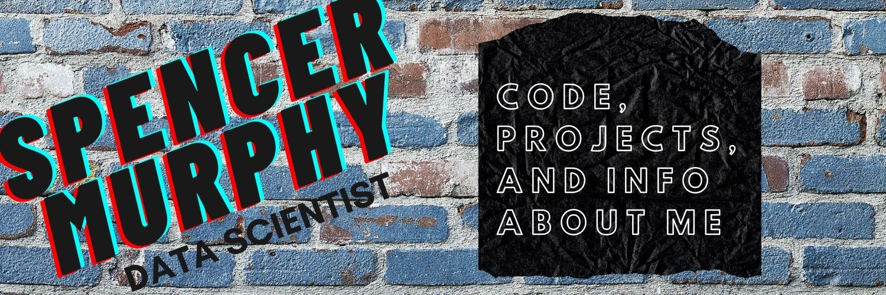

### Here are some highlights to check out:

- Neural_Networks: building a NN from the ground up in python, examining and justifying increasingly complex architectures
- Time_Series_Analysis: a tour of time series analysis in R on real world electricity usage data, with explanations
- Metaheuristics: python code to implement various gradient searches on known functions (Rosenbrock and Eggcrate) 

